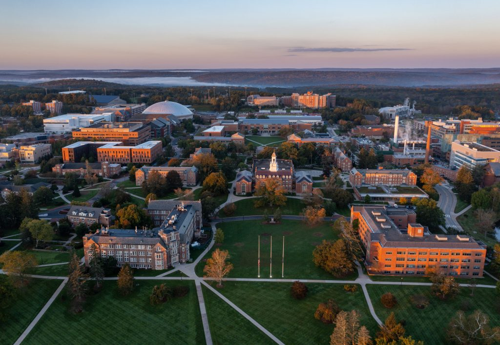

# Statistics in Quality, Industry, and Technology

**Dates:** June 21-24, 2027  
**Location:** UConn Storrs, Connecticut  
**Co-Chairs:** HaiYing Wang and Nalini Ravishanker

The 2027 Joint Research Conference (JRC) is the joint meeting of the **Quality and Productivity Research Conference (QPRC)** and the **Spring Research Conference (SRC)**. Hosted by the Department of Statistics at the University of Connecticut, JRC 2027 brings together researchers and practitioners from academia, industry, and government.

*Scenic campus of the University of Connecticut, Storrs*

# Conference Highlights

- Plenary and keynote talks by prominent figures in statistical quality and industrial technology
- Invited and contributed sessions covering a wide range of methodologies and applications
- Pre-conference short courses on cutting-edge topics sponsored by QPRC
- Student paper competition with travel support awards for junior researchers
- UConn Tech Park tours featuring advanced imaging, manufacturing, and energy labs

# Call for Papers

JRC 2027 invites submissions on research and applications at the intersection of statistics, quality, industry, and technology.

- Topics include quality engineering, reliability, process improvement, AI-enabled quality systems, and industrial analytics.
- The program will include invited and contributed sessions spanning methodologies and applications across academia, industry, and government.
- Submission guidelines and deadlines will be posted soon.
- Please check this page regularly for updates.

# Registration

Registration details, pricing tiers, and important deadlines will be announced soon.

Attendees should plan for arrival on Monday, June 21, 2027, with conference activities continuing through Thursday, June 24, 2027.

# Keynote Speakers

A distinguished lineup of keynote and plenary speakers from academia and industry is being finalized.

Speaker announcements will be added here as they are confirmed.

# Student Opportunities and Activities

JRC 2027 will include a student paper competition with travel support awards to encourage junior researchers, along with pre-conference short courses and UConn Tech Park tours featuring advanced imaging, manufacturing, and energy labs.

# Conference Schedule

The full program schedule, including sessions, short courses, keynote talks, and tours, will be published soon.

- Monday, June 21, 2027: Short courses 
- Tuesday, June 22, 2027: Opening events, technical sessions, and keynote talks
- Wednesday, June 23, 2027: Technical sessions, networking, and conference activities
- Thursday, June 24, 2027: Closing sessions

# Organizing Committee Co-Chairs

**Nalini Ravishanker**  
University of Connecticut  
[nalini.ravishanker@uconn.edu](mailto:nalini.ravishanker@uconn.edu)

**HaiYing Wang**  
University of Connecticut  
[haiying.wang@uconn.edu](mailto:haiying.wang@uconn.edu)
