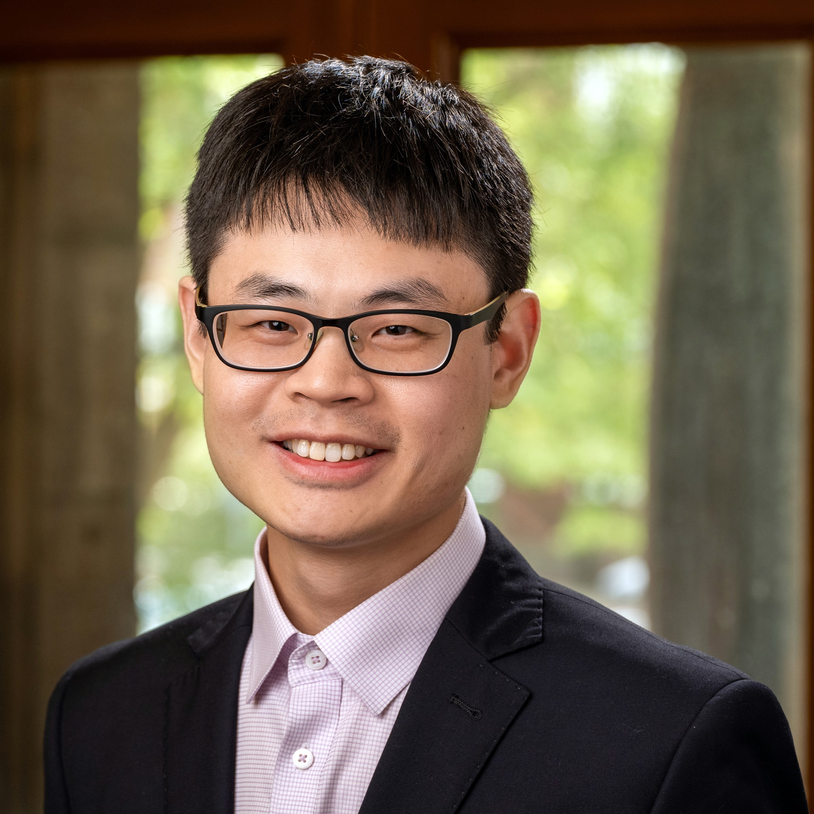

#+TITLE: Short Course
#+OPTIONS: toc:nil num:nil title:nil
#+DESCRIPTION: Scientific Machine Learning with Lu Lu of Yale University — a full-day pre-conference short course at JRC 2027.

* Scientific Machine Learning

** Abstract

The main objective of this course is to teach concepts and implementation of
deep learning techniques for scientific and engineering problems. This course
entails various methods, including the theory and implementation of deep
learning techniques to solve a broad range of computational problems frequently
encountered in solid mechanics, fluid mechanics, nondestructive evaluation of
materials, systems biology, chemistry, non-linear dynamics, etc.

** Instructor: Lu Lu, Yale University

#+ATTR_HTML: :alt Lu Lu :width 220px

Lu Lu is an Assistant Professor in the Departments of Statistics and Data
Science and of Chemical and Environmental Engineering at Yale University.
Prior to joining Yale, he was an Assistant Professor in the Department of
Chemical and Biomolecular Engineering at University of Pennsylvania from 2021
to 2023, and an Applied Mathematics Instructor in the Department of Mathematics
at Massachusetts Institute of Technology from 2020 to 2021. He obtained his
Ph.D. degree in Applied Mathematics at Brown University in 2020, master's
degrees in Engineering, Applied Mathematics, and Computer Science at Brown
University, and bachelor's degrees in Mechanical Engineering, Economics, and
Computer Science at Tsinghua University in 2013. His current research interest
lies in scientific machine learning and artificial intelligence for science,
including theory, algorithms, software, and its applications to engineering,
physical, and biological problems. His broad research interests focus on
multiscale modeling and high performance computing for physical and biological
systems. He has received the MIT Technology Review Innovators under 35 Asia
Pacific, U.S. Department of Energy Early Career Award, Mathematics Young
Investigator Award from MDPI, and Joukowsky Family Foundation Outstanding
Dissertation Award of Brown University.

** Format

- *Date:* Monday, June 21, 2027
- *Location:* University of Connecticut, Storrs (specific room TBA)
- *Duration:* Full day (approximately 9:00 a.m. – 5:00 p.m.)
- *Includes:* Coffee breaks and lunch

** Fees and Registration

The fee and registration details will be announced soon. Enrollment is subject
to capacity.
