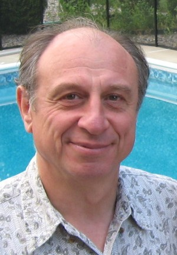

#+TITLE: Speakers
#+OPTIONS: toc:nil num:nil title:nil
#+DESCRIPTION: Conference Honoree, Keynote, Plenary, and invited speakers at JRC 2027.

* Speakers & Honoree

JRC 2027 will feature a distinguished lineup of invited speakers from academia,
industry, and government, and will celebrate our conference honoree.

** Conference Honoree & Keynote Speaker

#+ATTR_HTML: :alt Emmanuel Yashchin :width 220px

*** Emmanuel Yashchin
*Researcher-in-Residence, American University*

Emmanuel Yashchin is a Researcher-in-Residence at American University.  He
received the Diploma in Applied Mathematics from Vilnius State University in
1974, the M.Sc. degree in Operations Research and the D.Sc. in Statistics from
the Technion - Israel Institute of Technology, Haifa, in 1977 and 1981,
respectively. In 1982, he was a Visiting Assistant Professor at the Iowa
State University. From 1983 to 2023, he was a Research Staff Member at the
IBM Thomas J. Watson Research Center in Yorktown Heights, NY. From 1996 to
2002, he served as Manager of the Statistics Group in IBM Research
Division. His research interests include Quality Control, Reliability,
Statistical Modeling, Risk Analysis and Operations Research. He is a
co-editor of the journal "Applied Stochastic Models in Business and
Industry", Elected Member of the International Statistical Institute,
Fellow of the American Statistical Association and Senior Member of the
American Society for Quality.

He will deliver the keynote address opening the main conference on Tuesday,
June 22, 2027.

** Plenary Speakers

/Announcements coming soon./

** Invited Session Speakers

Invited sessions are organized by session chairs and cover a broad range of
topics in statistical quality, industrial statistics, and related fields. A
full list of invited sessions and their speakers will be posted once the
program is finalized.
